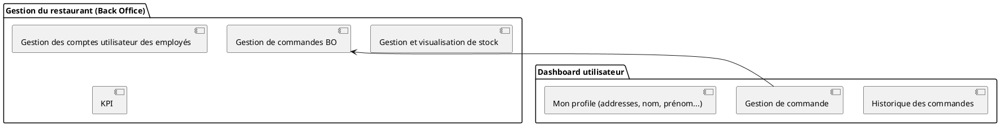

### Diagramme de composants

> Composant: Ensemble de classes qui représentent un système indépendant capable d'intéragir avec le reste du système



@todo: Interfacer Auth avec User
```plantuml
[Authentication]
package "AuthenticationOld" {
  [Création de compte]
  [Connexion]
  [Déconnnexion]
}

```

```plantuml
[Gestion de payments]

package "Composant Externes" {
[Paypal]
[Stripe]
[Gestion de payments] --> [Stripe]
[Gestion de payments] --> [Paypal]
}
```


<style>
.h1 {
  font-weight: bold;
  font-size: 24px;
}
.h2 {
  font-weight: bold;
  font-size: 18
}

@import url('https://fonts.googleapis.com/css2?family=Roboto:wght@100&display=swap');

html, body {
      font-family: "Avenir Next", sans-serif !important;
}

.info-block {
  display:block;
  position: relative;
  background: #FEF3C7;
  padding: 12px;
  padding-left: 32px;
  margin-top: 24px;
}

.info-block::before {
  position: absolute;
  content: "ℹ";
  left: 10px;
}
</style>

