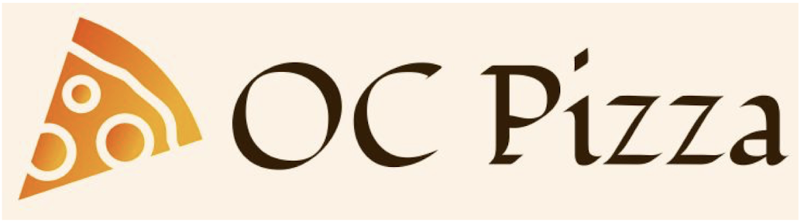
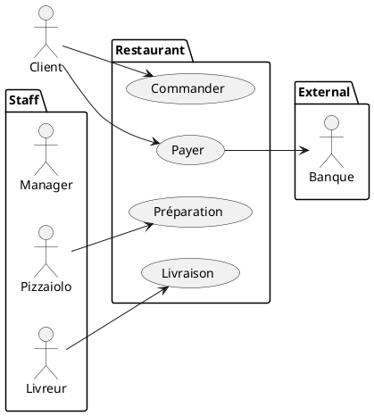
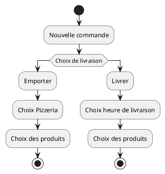
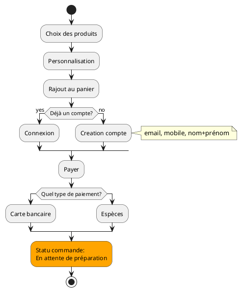
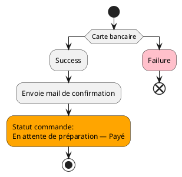
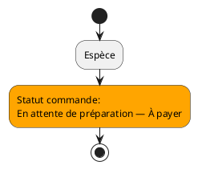

# Document de spécifications fonctionnelles

**IT Development**


[[@pagebreak]]

## Versions

| Auteur         | Date       | Description          | Version |
|----------------|------------|----------------------|---------|
| Cristian Rojas | 28/09/2021 | Création du document | 1       |

[[@pagebreak]]

[[@toc]]


[[@pagebreak]]


## Introduction

Pour scaler son modèle de business, le groupe OCPizza souhaite revoir son système numérique afin de répondre aux besoins de gestion nécessaire pour l'ouverture de 3 points de vente.

Le présent document a pour but de établir les bases d'un tel système en prévoyant et en répondant aux problématiques éventuelles liées à l'augmentation de franchisses, de clients et d'employés.

Cette prévision se basera sur la présentation à travers des acteurs du système, les personas, et les fonctionnalités satisfaisant les besoins du client.

## Acteurs du système

- Manager d'équipe
- Pizzaiolo
- Livreur
- Superadmin
- Client, dont:
	- Utilisateur
	- Visiteur
- Banque (acteur externe)

## Personas

### Rachid


- Développeur
- 23 ans
- Aimant de la nourriture rapide
- Exigeant niveau qualité
- Tous les jours de travail il commande le repas de midi sur des plateformes en lignes

### Héloïse


- Psychologue
- 55 ans
- Commande occasionnellement des pizzas quand elle n’a pas envie de faire à manger
- Elle n’est pas à l’aise avec la technologie
- Préfère appeller

### Nathan


- Responsable de cuisine
- 22 ans
- Passionné de la cuisine gourmet
- 4ans d'expérience dans la restauration.
- Suffisamment à l'aise avec la technologie, mais beaucoup moins qu'un jeune de son âge
- Bohème, passe peu de temps devant les écrans


## Enjeux UI

@todo: revoir, simplifier phrases
D'après l'étude des besoins d'utilisateur, on conclu que l'UI doit être simple pour que des gens comme Nathan puissent faire usage du site internet et aboutir avec succès le processus de commande.

La navigation pour Rachid, étant développeur de profession et un habitué de la commande en ligne ne présente pas d'enjeux particulier autre que l'utilisation des symboles reconnaissables et communs à un processus de commandes type, ceci ayant pour but de ne pas lui sortir du cadre qu'il connaît.

Quant à Héloïse, elle est sufissament à l'aise avec la technologie pour trouver le site internet de la pizzéria, mais probablement elle l'est moins pour aboutir à un processus de commande en ligne, il est donc impératif que le site soit fait de façon à quelle puisse trouver le numéro de téléphone et faire une commande téléphonique.

## Fonctionnalités

- Création de compte:
	- Saisie des information
		- Email
		- Password
		- Repeated password
	- Sauvegarde d’informations utilisateur
		- Nom + prénom 
		- Adresse 
		- Infos bancaires
		- Contraintes: RGPD
- Connexion
	- Email 
	- Password
	- Dashboard Client
		- Effectuer une commande
		- Historique des commandes: date + prix
		- Annulation d’une commande
		- Modification d'infos utilisateur
- BO interne permettant au Staff de: 
	- Modifier l’état d’une commande.
	- Suivre l’état d’une commande.
	- Consulter le stock des ingrédients
	- Modifier le stock
	- Administration/Modification de la carte aide-mémoire 
	- Affectation d’une commande à livrer (à l’intermédiaire des notifications)
	- Affectation d’une commande en préparation
	- Notification de commande (à l'intermédiaire d'un Dashboard centralisé dans la salle de commande)
- Voyant indicateur de la disponibilité de la pizza sur le frontend
- Paiement par carte bleu
- Aide mémoire pour les pizzaiolos.
- Statistiques de vente, performance par mois/an

## Scenarios d'utilisation (user stories):

- **En tant que** responsable **je veux pouvoir** visualiser le stock **pour** gérer les commands
- **En tant que** responsable **je veux pouvoir** rajouter des ingrédients **pour** gérer les commandes
- **En tant que** livreur **je veux pouvoir** changer le status de la commande **pour** gérer les commandes
- **En tant que** pizzaiolo **je veux pouvoir** réduire le stock d'un ingrédient en spécifique **pour** gérer les commandes
- **En tant que** utilisateur **je veux pouvoir** visualiser l'historiques des commandes **pour** gérer mes economies

## Cas d'utilisation général



## Procédure de commande: Utilisateur

Les schémas suivants présenteront la procédure de commande depuis la perspective de l’utilisateur et ce depuis la création de commande jusqu'à la livraison du produit.

<span class="info-block">Par simplicité la procédure a été découpée en plusieurs schémas.</span>





#### Détail du choix: carte bancaire




#### Détail du choix: par espèces




### Modifier commande
```plantuml
:Modifier commande commande;
if (En attente de préparation?) then (yes)
:Modification de commande;
stop
else (no)
#pink:Failure;
end
```

## Procèss de commande: Staff

### Pizzaiolo

```plantuml
#orange:Status commande:\nEn attente de préparation;
:Séléction dernière commande;
:Préparation de commande;
:Consultation de la fiche aide mémoire;
#orange:Statut commande:\nEn cours de préparation;
:Préparer commande;
if (Commande préparée?) then (yes)
#yellow:Statut commande:\nÀ livrer;
else (no)
:Préparer commande;
endif
stop
```

### Livreur

```plantuml
#yellow:Status commande:\nÀ livrer;
:Séléction dernière commande;
#green:Status commande:\nEn cours de livraison;
:Commande livrée;
#green:Status commande:\nLivrée;
stop
```

#### Détail
```plantuml
#yellow:Status commande:\nÀ livrer;
if (Payé?) then (yes)
:Livrer;
else (no)
:Facturer;
:Livrer;
endif
#green:Status commande:\nLivrée;
stop

```

<style>
.info-block {
  display:block;
  position: relative;
  background: #FEF3C7;
  padding: 12px;
  padding-left: 32px;
  margin-top: 24px;
}

.info-block::before {
  position: absolute;
  content: "ℹ";
  left: 10px;
}
</style>
