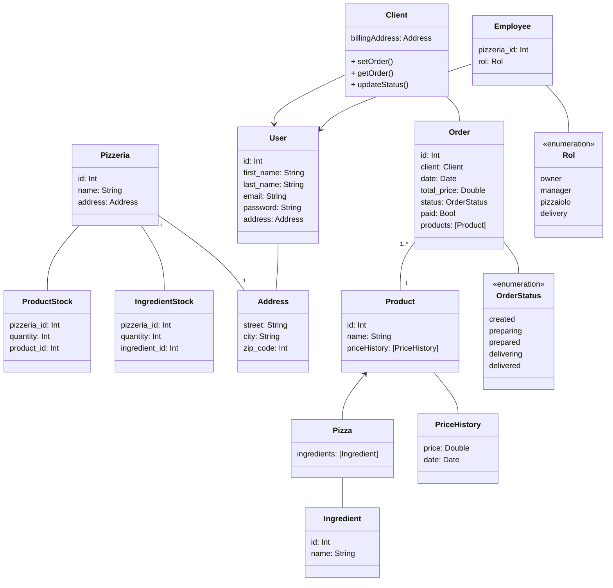
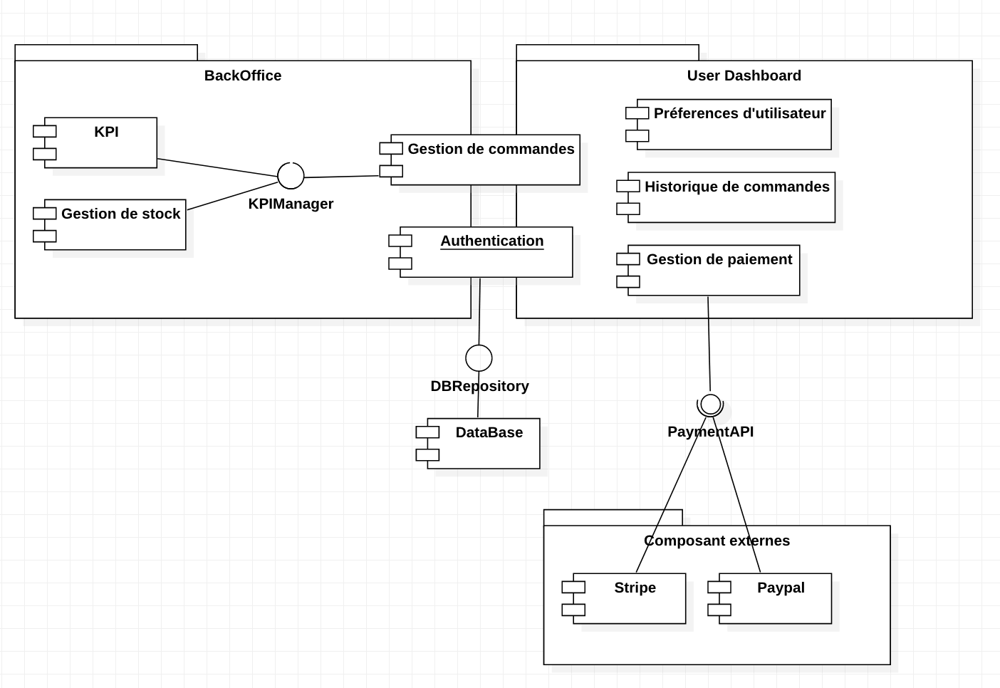
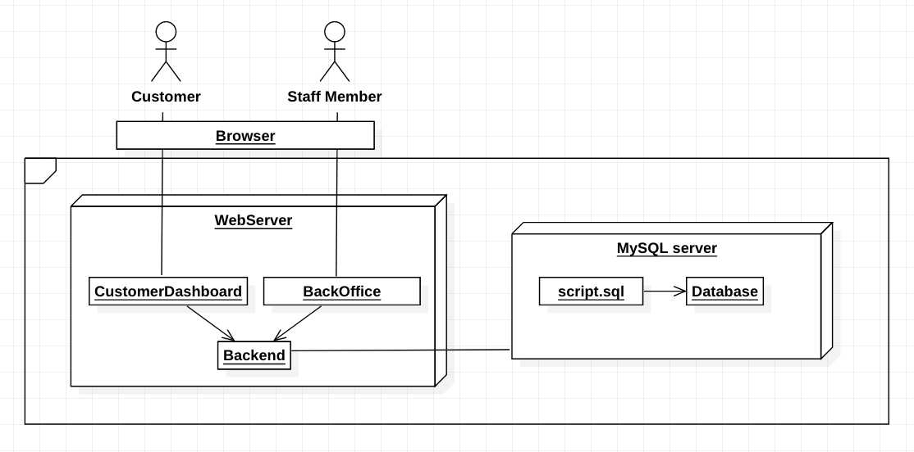

Document de spécifications techniques

IT Consulting & Development

OCPizza

[[@pagebreak]]

| Auteur         | Date       | Description        | Version |
| -------------- | ---------- | ------------------ | ------- |
| Cristian Rojas | 18/01/2022 | Début de rédaction | 1       |

[[@pagebreak]]

[[@toc]]

[[@pagebreak]]

## Rappel du contexte

« OC Pizza » est un jeune groupe de pizzeria en plein essor et spécialisé dans les pizzas livrées ou à emporter.

Comptant 5 points de vente, « OC Pizza »  prévoit d'ouvrir 3 nouveaux dans les prochains 6 mois.

## Introduction

Pour faire grandir son modèle de business, le groupe OCPizza souhaite revoir son système numérique afin de répondre aux besoins de gestion nécessaire pour l'ouverture de 3 points de vente.

Le présent document a pour but : 

1. D'apporter les bases techniques d'un tel système en modélisant les différents composants qui le composent.
2. Présenter le domaine fonctionnel du système
3. Les différents composants du système ainsi que les composants externes
4. Les interactions entre les différents composants

## Modélisation du système

### Diagramme de classes

### Diagramme de composants

### Diagramme de déploiement

@todo: Vérifier que le script fonctionne!
@todo, @presentation: décrire comment modéliser un array sous forme de table d'association

