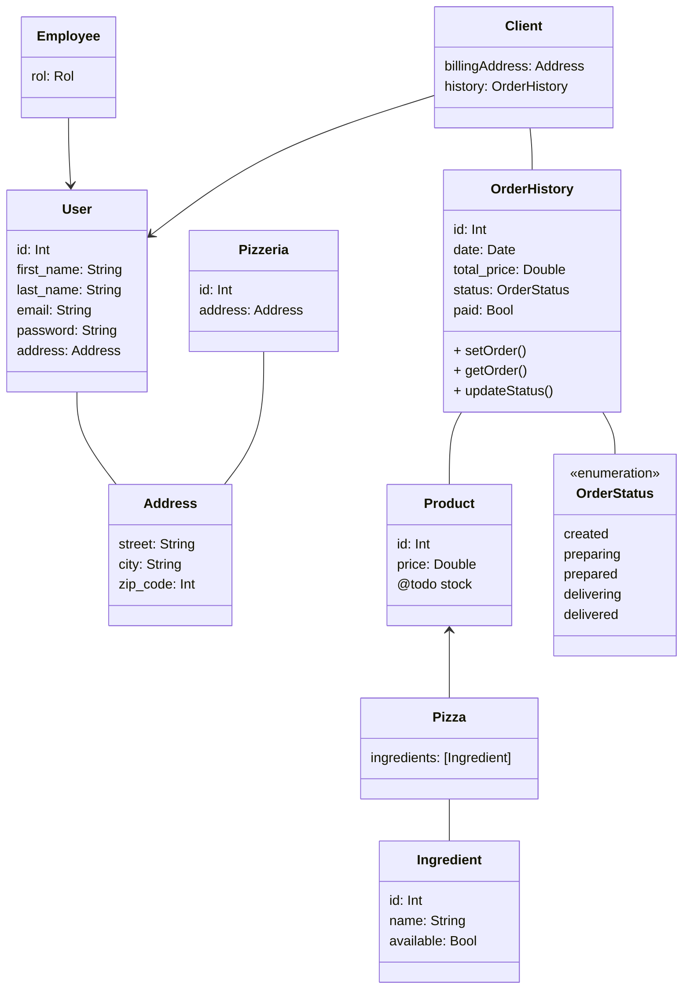

# Untitled

```mermaid
classDiagram

class Pizzeria {
  id: Int
  address: Address
}

class Address {
  street: String
  city: String
  zip_code: Int
}


class User {
id: Int
first_name: String
last_name: String
email: String
password: String
address: Address
}

Pizzeria -- Address
User -- Address

class Client {
billingAddress: Address
history: OrderHistory
}

class OrderHistory {
id: Int
date: Date
total_price: Double
status: OrderStatus
paid: Bool
}

OrderHistory: + setOrder()
OrderHistory: + getOrder()
OrderHistory: + updateStatus()

class Product {
id: Int
price: Double
@todo stock
}

class OrderStatus {
<<enumeration>>
created
preparing
prepared
delivering
delivered
}

class Pizza {
ingredients: [Ingredient]
}

class Ingredient {
  id: Int
  name: String
  available: Bool
}

Product <-- Pizza
Pizza -- Ingredient

OrderHistory -- OrderStatus

OrderHistory -- Product

Client -- OrderHistory

class Employee {
  rol: Rol
}

Client --> User
Employee --> User


```

test
