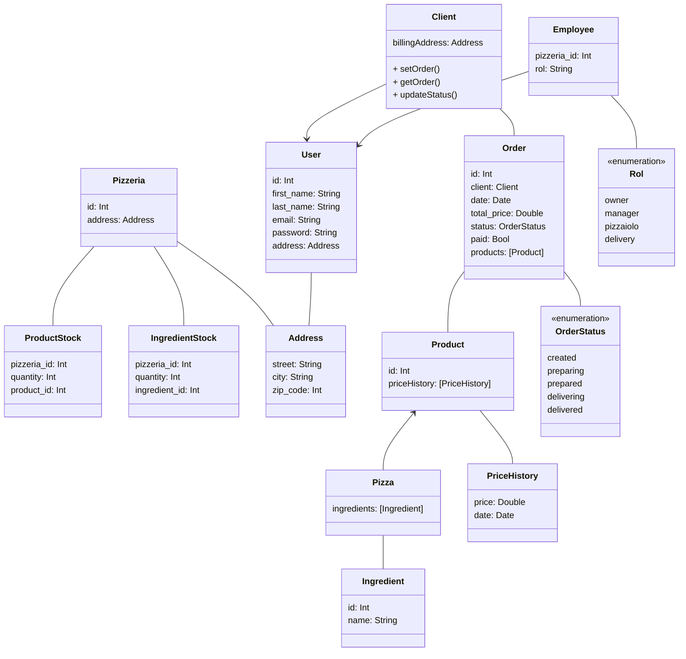

```mermaid
classDiagram

class Pizzeria {
  id: Int
  address: Address
}

class ProductStock {
  pizzeria_id: Int
  quantity: Int
  product_id: Int
}

class IngredientStock {
  pizzeria_id: Int
  quantity: Int
  ingredient_id: Int
}

Pizzeria -- ProductStock
Pizzeria -- IngredientStock

class Address {
  street: String
  city: String
  zip_code: Int
}


class User {
id: Int
first_name: String
last_name: String
email: String
password: String
address: Address
}

Pizzeria -- Address
User -- Address

class Client {
billingAddress: Address
}

class Order {
id: Int
client: Client
date: Date
total_price: Double
status: OrderStatus
paid: Bool
products: [Product]
}

Client: + setOrder()
Client: + getOrder()
Client: + updateStatus()

class Product {
id: Int
priceHistory: [PriceHistory]
}

class OrderStatus {
<<enumeration>>
created
preparing
prepared
delivering
delivered
}

class Pizza {
ingredients: [Ingredient]
}

class Ingredient {
  id: Int
  name: String
}

Product <-- Pizza
Pizza -- Ingredient

Order -- OrderStatus

Order -- Product

Client -- Order

class Employee {
  pizzeria_id: Int
  rol: String
}

class Rol {
  <<enumeration>>
  owner
  manager
  pizzaiolo
  delivery
}

class PriceHistory {
  price: Double
  date: Date
}

Product -- PriceHistory

Employee -- Rol
Client --> User
Employee --> User


```

